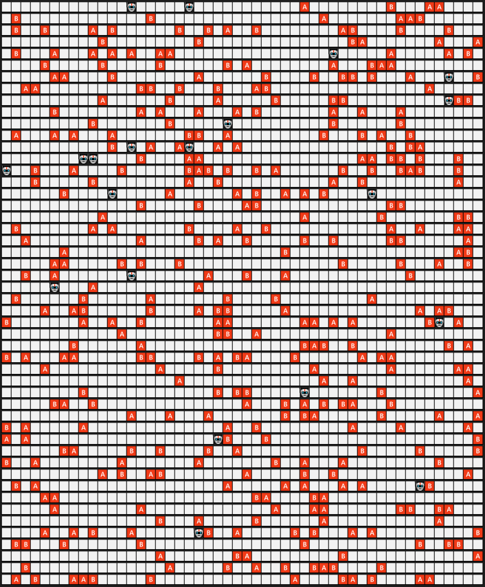
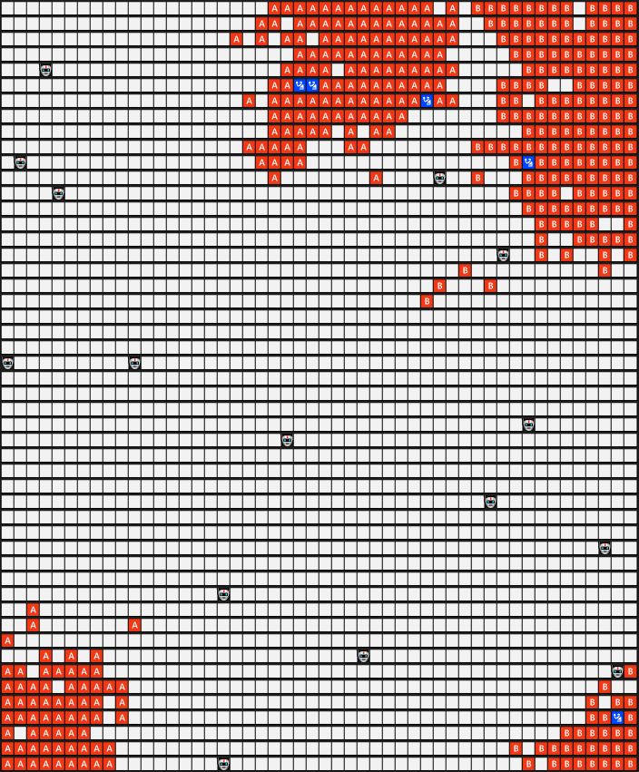

# Rapport SMA Tri collectif multi-agents
#### BRUNEAU Richard - VASLIN Pierre

## Introduction 

Nous avons décidé de lever la contrainte du sujet qui interdisait d'avoir un agent et un objet sur la même case afin de se placer dans le contexte de l'article. La représentation graphique dans ce genre de situation est explicité dans le README.md.

## Réalisation 

### Question 1 

#### Implémentation

Dans un premier temps, nous avons suivi le sujet pour la prise et le dépôt d'un objet. Nous avons donc implémenté cette prise en se concentrant sur le voisinage de l'objet (cf. src/agent.py/proportionCalculationNeighborhood) en utilisant les formules indiquées dans le sujet.  

Après cette première implémentation, nous avons suivi l'article afin d'implémenter la prise et le dépôt en fonction de la mémoire. 

#### Outil d'analyse des résultats

Dans un premier temps, nous nous sommes aperçu visuellement que la prise de décision à l'aide de la mémoire était plus efficace que la méthode grâce à l'entourage. Afin de mesurer la différence entre les deux méthodes, nous avons calculé une valeurs qui évalue la concentration des objets de même type.

brouillon
On parcoure tous les objets est l'on compte le nombre de voisin qui est sont de même type que lui, puis on calcul le ratio de de voisin de même type par rapport au nombre de total de voisin. (Voir `evaluateEnv` dans [environnement.py](./src/environnement.py)). Ensuite on calcule la moyenne et le premier quartile de ces taux. C'est deux valeurs permette de bien analyser la concentration des block de même type.

Pour des raisons de performance, on réalise la mesure  toute les m étapes valeur que l'on peut changer dans le code [triCollectif.py](./src/triCollectif.py). 
#### Règles d'arrêts

Les agents ne s'arrêtent pas de triller même si le tri est satisfaisant. Nous avons donc mis en place un seuil qui se base le premier quartile fournie par la fonction `evaluationEnv`. On ne souhaite pas que l'on arrête le programme lorsqu'il attaint le seuil, il peut arrivé que le seuil dans des configurations soit atteint alors que les objets ne soit pas tous à fait organiser, c'est pour ça que nous avons mis en place une fenêtre glissante sur les premier quartils de l'environnement pour chaque étape. Pour savoir quand arrêter le tri avec la fenêtre glissante on regarde si le pourcentage de valeurs supérieur au seuil est supérieur au pourcentage p que l'on peut faire varier dans le code [triCollectif.py](./src/triCollectif.py).

### Analyse des résultats

Nous avons lancé plusieurs executions afin de vérifier que les courbes de résultats ci-dessous ne sont pas des "accidents" et que les résultats reflètent bien le comportement des agents. 

Au début de la simulation, la grille est sous cette forme :

Après 500 000 itérations, nous obtenons une grille sous cette forme :

Comme vous pouvez le constater, il existe 4 clusters bien indépendants. Deux pour les objets A et deux pour les objets B. On remarque 

brouillon : 
Avec la mémoire, meilleure résultat, mais le pic d'efficacité est plus lent à arriver

Sans mémoire, moins bon résultat, mais le seuil maximal est inférieur. 

Bien s'appuyer sur les graph et les valeurs pour analyser.

### Question 2 

### Implémentation 

Dans cette deuxième partie du TP nous avons implémenté un pourcentage d'erreur (modifiable lors de l'appel de la fonction) afin de créer du bruit lors de la perception des objets. 

De plus, notre programme s'arrête quand un seuil de satisfaction est atteint ou, afin de limiter le temps d'exécution, au bout de 500 000 pas de temps, variable modifiable dans src/triCollectif.py/ variable stepDefault. Un pas de temps est un cycle perception/action de l'intégralité des agents. 

[TODO] : Analyser avec des bruits différents 

### Outils d'analyse des résultats

Comme lors de la question 1, nous nous sommes rapidement aperçu visuellement que les clusters étaient moins nombreux et donc plus gros. Afin de confirmer notre pensée nous avons utilisé les mêmes mesures que lors de la question précédente. En effet, avec des clusters plus important, notre densité est sensé augmenté car cela fait plus d'objet avec huit voisins. 

[TODO] Pierre : Justifier l'utilisation de la seconde mesure via le quartile. 

### Analyse des résultats

A nouveau, nous avons lancé plusieurs execution afin de s'assurer que les captures ci-dessous reflètent le comportement habituel des agents que nous avons implémenté. 

# TODO

Question 2 : Parler que les clusters sont plus gros, mais comporte un taux d'erreur important