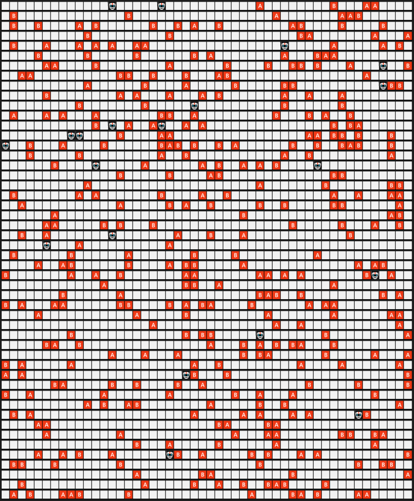

# Rapport SMA Tri collectif multi-agents
#### BRUNEAU Richard - VASLIN Pierre

## Introduction 

Nous avons décidé de lever la contrainte du sujet qui interdisait à un agent et un objet de partager la même case afin de se placer dans le contexte de l'article. Vous trouverez ci-dessous la légende de notre représentation graphique.

Avant que les agents commencent à trier, la grille est ordonnée aléatoirement avec des objets dispercés un peu partout comme ci-dessous.

## Réalisation 

### Question 1 

#### Implémentation

Dans un premier temps, nous avons suivi le sujet pour la prise et le dépôt d'un objet. Nous avons donc implémenté cette prise en se concentrant sur le voisinage de l'objet (cf. `proportionCalculationNeighborhood` dans [agent.py](./src/agent.py)) en utilisant les formules indiquées dans le sujet.

Après cette première implémentation, nous avons suivi l'article afin d'implémenter la prise et le dépôt en fonction de la mémoire.

#### Outil d'analyse des résultats

Dans un premier temps, nous nous sommes aperçu visuellement que la prise de décision à l'aide de la mémoire était plus efficace que la méthode grâce à l'entourage. Afin de mesurer la différence entre les deux méthodes, nous avons calculé une valeur qui évalue la concentration des objets de même type.

Pour cela, on parcourt tout les objets et on compte le nombre de voisins qui sont du même type que l'objet courant, ensuite on calcule le ratio de voisins de même type par rapport au nombre total de voisins. (Voir `evaluateEnv()` dans [environnement.py](./src/environnement.py)). Après cela, on calcule la moyenne et le premier quartile du ratio. Ces deux statistiques permettent de bien analyser la concentration des blocks de même type.

Pour des raisons de performances, on réalise la mesure toutes les m étapes, valeur que l'on peut changer à l'aide de la variable `stepGrap` dans le code de [triCollectif.py](./src/triCollectif.py). 

Nous avons lancé plusieurs executions afin de vérifier que les courbes de résultats présentes dans la partie *Analyse des résultats* ne sont pas des "accidents" et que les résultats reflètent bien le comportement des agents.

Nous en avons également profité pour contrôler et ajuster les valeurs d'évaluations afin d'être certains qu'elle permettent de suivre correctement l'évolution du tri dans l'environnement. C'est ainsi que nous avons choisie comme seuil 6/8. En effet, un objet possède au maximum 8 voisins (N-S-E-O-NE-NO-SE-SO) et nous comptons donc le nombre de voisins qu'il possède. Pour la fenêtre glissante, nous l'avons paramètrée avec une taille égale à 10 et un pourcentage de 75%.

#### Règles d'arrêts

Individuellement, les agents ne s'arrêtent pas de trier, même si le tri est satisfaisant. Nous avons donc mis en place un seuil qui se base sur le premier quartile fournie par la fonction `evaluationEnv()` vue  précédement. En revanche, nous ne souhaitons pas que le programme s'arrête dès que le seuil est atteint. Il peut arriver que le seuil soit atteint dans des configurations où tout les objets ne sont pas encore complètement organisés. 

C'est pour cela que nous avons mis en place une fenêtre glissante sur les premier quartile de l'environnement pour chaque étape. Pour savoir quand arrêter le tri avec la fenêtre glissante on regarde si le pourcentage de valeurs supérieures au seuil est supérieur au pourcentage p que l'on peut faire varier dans le code [triCollectif.py](./src/triCollectif.py).

Pour parer le cas où le seuil est atteint après un temps d'exécution trop long du programme nous arrêtons ce dernier au bout de 5 millions pas de temps. Un pas de temps est un cycle perception/action de l'intégralité des agents. Le nombre de pas de temps total est une variable modifiable dans [triCollectif.py](./src/triCollectif.py/) variable `stepDefault`. 

### Analyse des résultats

#### Sans mémoire

Analysons dans un premier temps le tri sans mémoire. Nous pouvons constater que les objets sont triés mais que les clusters ne sont pas agencés proprement. Il y a beaucoup de petits clusters et leur périmètre ne forment pas des quadrilatères ce qui optimiserait l'espace ainsi que les statistiques décrites précédement. De plus, de nombreux clusters contiennent des cases vides à l'intérieur ce qui accentue le manque d'optimisation.

Comme nous pouvons le constater, sur les courbes ci-dessus, le seuil n'est pas atteint, le tri s'est donc arrêté aprés 5 milliions d'iterrations. Nous pouvons analyser que très peu d'étapes sont nécessaires afin d'arriver à un nombre de voisins moyen de 0.5. Ensuite cette statistique varie tout en n'atteignant jamais le seuil. Nous pouvons en déduire que les fomules utilisées pour la prise et le dépot d'objets ne sont pas adaptées. Au bout d'un certain pas de temps, nous obtenons une latéralisation de nos statistiques et donc du tri.

#### Avec mémoire

Maintenant, concentrons nous sur le tri avec mémoire. Nous pouvons aisément constater que le nombre de clusters a diminué et que leur importance à donc augmenté. Nous constatons également que les clusters sont agencés de manière un peu plus propre, même si cela n'est pas parfait en terme d'optimisation d'espace. 

La diminution du nombre de cluster et leur meilleur agencement engendre de meilleurs résultats. En effet, avec un nombre de cluster réduit, les objets ont plus de voisins. De plus, le seuil est franchi dans le cadre de la moyenne et atteint à plusieurs reprises dans le cadre de la médiane. Cela a permis l'arret de l'exécution du programme.

Nous pouvons établir que la croissance des résultats est plus lente en utilisant la mémoire. Cela veut dire que le tri se fait d'une meilleure façon sur les premières itérations en utilisant le voisinage. Ce résultat semble être lié au fait que l'agent a besoin de se construire une mémoire avant de pouvoir prendre sa décision de prise ou de dépôt d'objet.

Après l'analyses des résultats, nous avons constaté que le premier quartile permet de mieux suivre l'évolution de l'environnement que la moyenne. On a donc utilisé cette valeur pour mettre en place notre seuil d'arrêt.

### Question 2 

### Implémentation 

Dans cette deuxième partie du TP nous avons implémenté un pourcentage d'erreurs (paramétrable lors de l'appel de la fonction) afin de créer du bruit lors de la perception des objets.  

### Outils d'analyse des résultats

Comme lors de la question 1, nous nous sommes rapidement aperçu visuellement que les clusters étaient moins nombreux et donc plus gros. Afin de confirmer notre pensée nous avons utilisé les mêmes mesures que lors de la question précédente. En effet, avec des clusters plus important, notre densité doit augmenté car cela fait plus d'objets avec huit voisins. 

### Les résultats

Dans cette partie, toutes nos simulations utilisent la mémoire. En effet, nous avons jugé plus pertinenent de rester sur cette approche car elle offrait de meilleures performances avec nos statistiques, ce qui sous entend que c'est une meilleure approche. 

A nouveau, nous avons lancé plusieurs exécutions afin de s'assurer que les captures ci-dessous reflètent le comportement habituel des agents que nous avons implémenté. 

#### Taux d'erreur 0.1

Avec un taux d'erreurs à 0.1, nous constatons qu'il n'y a qu'un seul cluster mais divisé en deux parties. Une partie pour les objets A et une partie pour les objets B. En regardant de plus près, on peut remarquer la présence d'objets du mauvais type en périphérie de chaque partie. Evidement, ces présences sont liées au taux d'erreurs. 

Ici, la simulation s'est arrêtée en 5 millions pas de temps et non via notre système d'arrêt.

fs.png)

#### Taux d'erreur 0.5

fs.png)

Dans cette simulation avec un taux d'erreurs à 0.5, nous remarquons à nouveau la présence d'un unique cluster mais indivisible. En effet, les objets de chaque types sont réparties uniformément au seins de ce cluster.

A nouveau, la simulation s'est arrêtée en 5 millions pas de temps et non via notre système d'arrêt.

### Analyse des résultats

D'un point de vue purement statistiques maintenant, nous pouvons constater que le taux d'erreur à 0.1 a réduit l'amplitude de nos courbes, mais elles conservent une allure semblable. Pour un taux d'erreur à 0.5 le même phénomène, mais en plus accentuté ce produit sur la courbe de la moyenne. À contrario, pour la statistique lié au quartile, la courbe est complètement différente et plafonne autour de 0.4. 

## Conclusion

Nous avons pu constater que malgré le temps de mise en route, le tri à l'aide de la mémoire est plus pertinent que le tri à l'aide du voisinage. Les objets sont mieux triés et mieux organisés au sein des clusters réalisés par les agents. Dans la seconde partie du TP, nous nous sommes aperçu que l'ajout d'un léger taux d'erreurs permettait de réduire à nouveau le nombre de cluster. En revanche, ce bruit provoque un tri moins efficace au sein du cluster créé et ne permet pas d'atteindre des valeurs statistiques qui permettraient d'arrêter le programme. Enfin, nous avons pu constater que si le bruit est trop important les agents rassemblent les objets au même endroit, mais n'effectuent aucun tri car leur perception est altérée. 