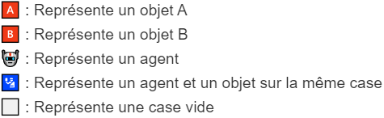
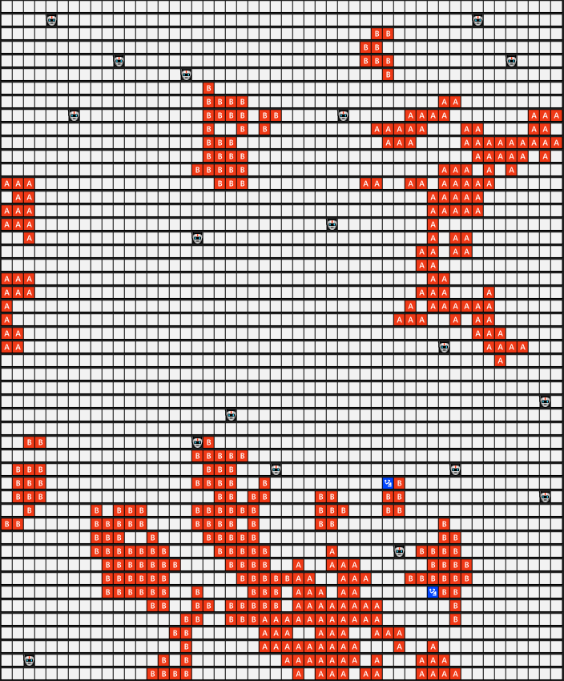
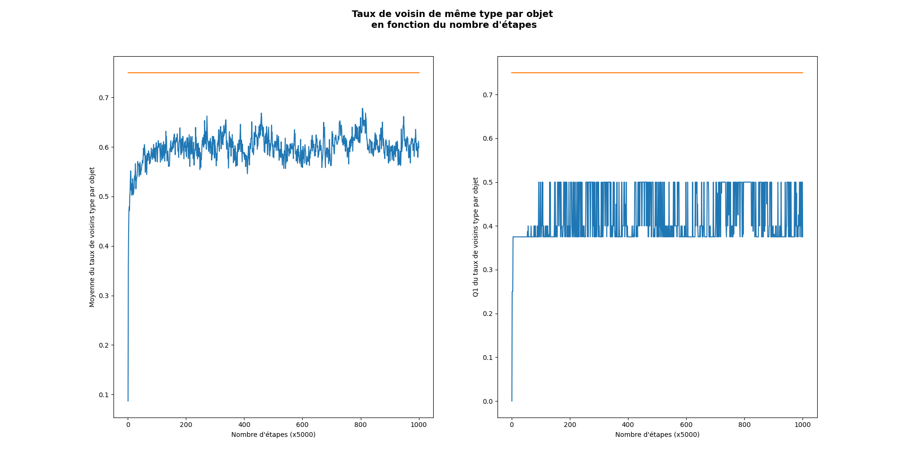
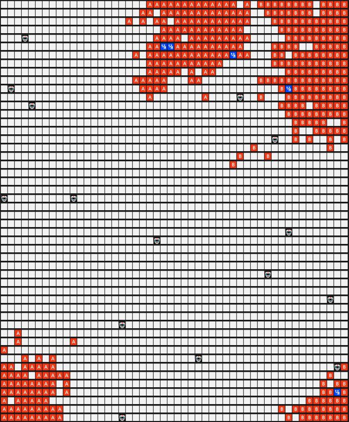
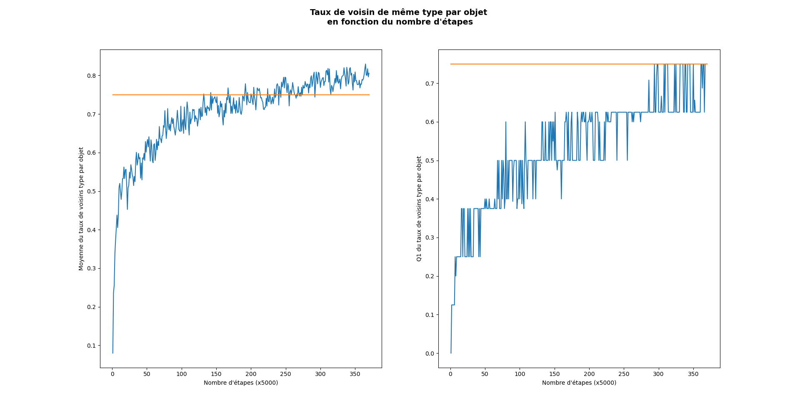
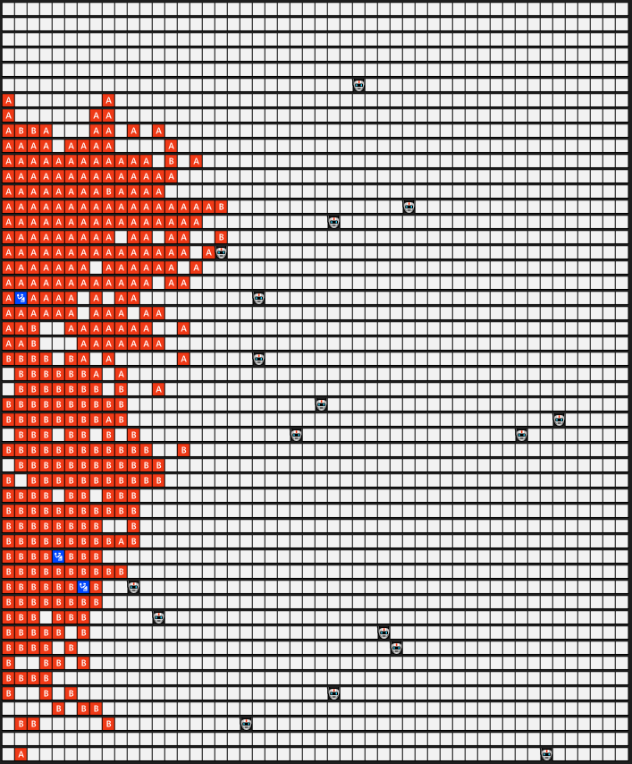
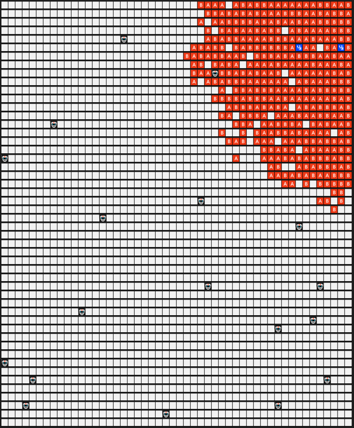

# Rapport SMA Tri collectif multi-agents
#### BRUNEAU Richard - VASLIN Pierre

## Introduction 

Nous avons décidé de lever la contrainte du sujet qui interdisait d'avoir un agent et un objet sur la même case afin de se placer dans le contexte de l'article. La représentation graphique dans ce genre de situation est explicité dans le README.md.

## Réalisation 

### Question 1 

#### Implémentation

Dans un premier temps, nous avons suivi le sujet pour la prise et le dépôt d'un objet. Nous avons donc implémenté cette prise en se concentrant sur le voisinage de l'objet (cf. src/agent.py/proportionCalculationNeighborhood) en utilisant les formules indiquées dans le sujet.  

Après cette première implémentation, nous avons suivi l'article afin d'implémenter la prise et le dépôt en fonction de la mémoire. 

#### Outil d'analyse des résultats

Dans un premier temps, nous nous sommes aperçu visuellement que la prise de décision à l'aide de la mémoire était plus efficace que la méthode grâce à l'entourage. Afin de mesurer la différence entre les deux méthodes, nous avons calculé une valeur qui évalue la concentration des objets de même type.

Pour cela, on parcourt tout les objets et on compte le nombre de voisins qui sont du même type que l'objet courant, ensuite on calcule le ratio de voisins de même type par rapport au nombre de total de voisins. (Voir `evaluateEnv` dans [environnement.py](./src/environnement.py)). Après cela, on calcule la moyenne et le premier quartile du ratio. Ces deux statistiques permettent de bien analyser la concentration des blocks de même type.

Pour des raisons de performances, on réalise la mesure toutes les m étapes, valeur que l'on peut changer dans le code [triCollectif.py](./src/triCollectif.py). 

#### Règles d'arrêts

Les agents ne s'arrêtent pas de trier même si le tri est satisfaisant. Nous avons donc mis en place un seuil qui se base sur le premier quartile fournie par la fonction `evaluationEnv`. En revanche, nous ne souhaitons pas que le programme s'arrête dès que le seuil est atteint. Il peut arriver que le seuil soit atteint dans des configurations où tout les objets ne sont pas encore complètement organisés. 

C'est pour cela que nous avons mis en place une fenêtre glissante sur les premier quartile de l'environnement pour chaque étape. Pour savoir quand arrêter le tri avec la fenêtre glissante on regarde si le pourcentage de valeurs supérieures au seuil est supérieur au pourcentage p que l'on peut faire varier dans le code [triCollectif.py](./src/triCollectif.py).

### Analyse des résultats

Nous avons lancé plusieurs executions afin de vérifier que les courbes de résultats ci-dessous ne sont pas des "accidents" et que les résultats reflètent bien le comportement des agents. 

Nous en avons également profiter pour controller et ajuster les valeurs d'évaluations afin d'être certains qu'elle permettent de suivre correctement l'évolution du tri dans l'environnement. 

Après l'analyses des résultats, nous avons constaté que le premier quartile permet de mieux suivre l'évolution de l' environnement que la moyenne. On a donc utilisé cette valeur pour mettre en place notre seuil d'arrêt. 

Pour nos test nous avons choisie comme seuil 6/8. En effet, un objet possède au maximum 8 voisins (N-S-E-O-NE-NO-SE-SO) et nous comptons donc le nombre de voisin qu'il possède. Pour la fenêtre glissante, nous l'avons paramètré avec une taille 10 et de pourcentage 75%.

#### Sans mémoire
{ width=40% }

Comme nous pouvons le constater, sur les courbes ci-dessus, le seuil n'est pas atteint, le tri s'est donc arrêté aprés 5 milliions d'iterrations.

#### Avec mémoire
{ width=40% }

En utilisant la mémoire, le nombre de cluster se réduit. Cela engendre de meilleurs résultats. En effet, avec un nombre de cluster réduit, les objets ont plus de voisins.  

Nous pouvons également constater que la croissance des résultats est plus lente en utilisant la mémoire. Cela veut dire que le tri se fait d'une meilleure façon sur les premières itérations en utilisant le voisinage. Ce résultat semble être lié au fait que l'agent a besoin de se construire une mémoire avant de pouvoir construire sa décision de prise ou de dépôt d'objet. 

### Question 2 

### Implémentation 

Dans cette deuxième partie du TP nous avons implémenté un pourcentage d'erreur (modifiable lors de l'appel de la fonction) afin de créer du bruit lors de la perception des objets. 

De plus, notre programme s'arrête quand un seuil de satisfaction est atteint ou, afin de limiter le temps d'exécution, au bout de 5 millions pas de temps, variable modifiable dans src/triCollectif.py/ variable stepDefault. Un pas de temps est un cycle perception/action de l'intégralité des agents. 

[TODO] : Remonter la définition du pas de temps

[TODO] : Analyser avec des bruits différents 

### Outils d'analyse des résultats

Comme lors de la question 1, nous nous sommes rapidement aperçu visuellement que les clusters étaient moins nombreux et donc plus gros. Afin de confirmer notre pensée nous avons utilisé les mêmes mesures que lors de la question précédente. En effet, avec des clusters plus important, notre densité doit augmenté car cela fait plus d'objets avec huit voisins. 

[TODO] Pierre : Justifier l'utilisation de la seconde mesure via le quartile. 

### Les résultats
#### Taux d'erreur 0.1
{ width=40% }fs.png)

#### Taux d'erreur 0.5
{ width=40% }fs.png)

Les deux fin step, ils n'ont pas atteint le seuil

### Analyse des résultats

A nouveau, nous avons lancé plusieurs exécution afin de s'assurer que les captures ci-dessous reflètent le comportement habituel des agents que nous avons implémenté. 

[TODO]
Question 2 : Parler que les clusters sont plus gros, mais comporte un taux d'erreur important

